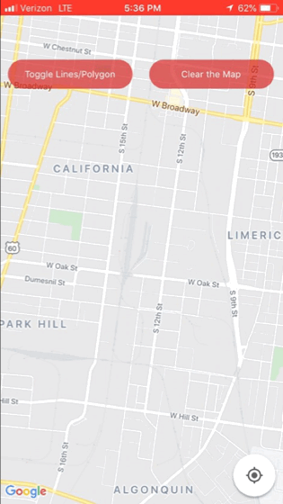
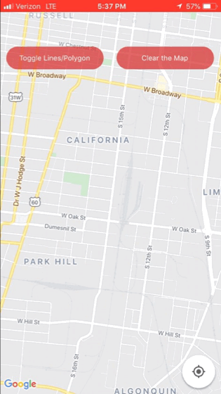

# React Native Shape/Area Calculator Demo (iOS)

I've seen questions online that pertain to using malleable lines/polygons in react-native-maps as well as other useful features, so I decided to put some short demo code up in one place. The features of this code include:

* Place marker via screen tap 
* Placing a second marker or more will cause a Polyline to be drawn between that marker and its preceding one
* Holding and dragging a marker will cause the Polylines to dynamically move with the new marker location
* Toggle between Polylines and their equivalent Polygon with the press of a button
* Polygons also respond to dragging and will change shape dynamically
* Tap on the Polygon for an alert that displays its approximate area in meters squared

## Installation

This demo was made with [Expo](https://www.google.com/search?q=expo+io&oq=expo+io&aqs=chrome..69i57j0l4j69i60l3.2889j0j7&sourceid=chrome&ie=UTF-8). You can follow the instructions on how to get Expo [here](https://expo.io/learn).

You can download this repository, though it lacks an app.json filed (which I added to my gitignore). Simply add a file to the root folder, name it app.json and paste the following code into it:
```javascript
{
  "expo": {
    "name": "Blank Template",
    "slug": "PedometerMap",
    "privacy": "public",
    "sdkVersion": "36.0.0",
    "platforms": [
      "ios",
      "android",
      "web"
    ],
    "version": "1.0.0",
    "orientation": "portrait",
    "icon": "./assets/icon.png",
    "splash": {
      "image": "./assets/splash.png",
      "resizeMode": "contain",
      "backgroundColor": "#ffffff"
    },
    "updates": {
      "fallbackToCacheTimeout": 0
    },
    "assetBundlePatterns": [
      "**/*"
    ],
    "ios": {
      "supportsTablet": true,
      "infoPlist": {
        "UIBackgroundModes": [
          "location",
          "fetch"
        ]
      }
    }
  }
} 
```
From there you can
```bash
npm install
```
in the root folder and then
```bash
expo start
```
## Usage
Below are demo snippets of the features this code contains.

### Connectable Markers


### Stretch Polylines


### Toggle into Polygon


### Stretch the Polygon


### Check the area of Polygon by clicking it


### Check area after resizing


## Contributing
Feel free to repurpose this how you'd like, and if you re-use it in an interesting way please show me!

## Credits
The editable drag code was excerpted from a post by [Bassonlinho](https://github.com/Bassonlinho) located [here](https://github.com/react-native-community/react-native-maps/issues/1685)

The function to compute the area was lifted from a post by [PatrickCavalcanti](https://github.com/PatrickCavalcanti) located [here](https://github.com/react-native-community/react-native-maps/issues/2365)


## License
[MIT](https://choosealicense.com/licenses/mit/)
